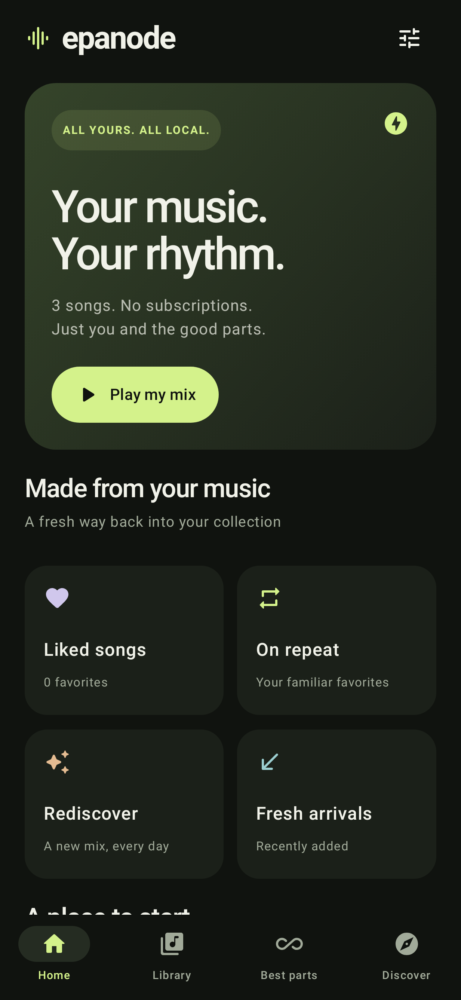
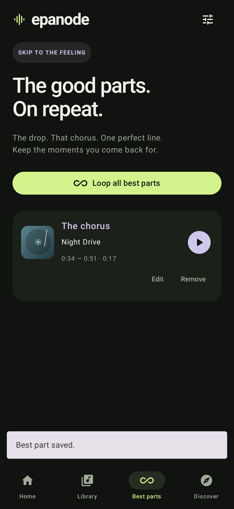
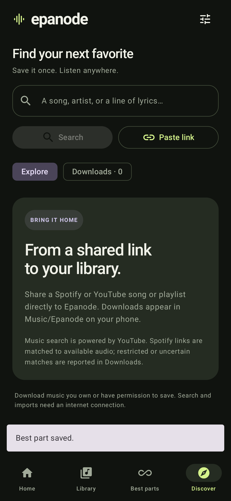

# Epanode

**Return to the good part.**

[](https://github.com/ashr-exe/epanode/actions/workflows/android-ci.yml)
[](https://github.com/ashr-exe/epanode/actions/workflows/codeql.yml)

A small, native Android music player for the music on your phone. Kotlin, Compose, Media3, SQLite, and WorkManager. Android 10 or newer. No account, advertising, analytics SDK, or server to operate.

[Download APK and source from Releases](https://github.com/ashr-exe/epanode/releases) · [Report a bug](https://github.com/ashr-exe/epanode/issues)

The name is inspired by *epanodos*, a classical rhetorical return to an earlier theme ([Silva Rhetoricae](https://rhetoric.byu.edu/Figures/E/epanodos.htm)): rediscover your own music and return to a favorite moment.

**Version 0.1.0 is an initial implementation, not complete Spotify/YouTube Music feature parity or a production-certified release.** Read [feature coverage](docs/FEATURES.md) and [testing](docs/TESTING.md) for the precise scope and verification limits.

<p>
  
  
  
</p>

See [release procedures](docs/RELEASING.md), [changelog](CHANGELOG.md), and [contribution guide](CONTRIBUTING.md). Android CI builds, tests, lints, and runs an Android 15 emulator suite. CodeQL analyzes Kotlin/Java. Dependabot groups monthly updates; none of these repository tools adds code to the Android app.

## Install and start

1. Copy the accompanying `Epanode-0.1.0.apk` to your Android phone and open it. Android will ask you to allow installation from that file source. This is a locally signed test build, not a Play Store release.
2. Open Epanode and tap **Find my music**. Allow audio access. Use **Settings → Add a music folder** for folders or lyric files that Android did not index.
3. Tap a song to play. Tap the mini-player for the player, queue, lyrics, speed, and sleep timer.
4. Open a song’s menu → **Save a best part**. Name it, enter exact times or adjust the range, preview the loop, then save. **Best parts** loops individual moments or the whole collection. Playlist pages can loop their saved parts.
5. **Discover** searches online or accepts Spotify, YouTube, YouTube Music, and direct HTTPS audio links. You can also share links from another app to Epanode. Downloads use Wi-Fi by default and are saved under `Music/Epanode`.

Only download material you own or have permission to save. Restricted content is reported as an error. Spotify supplies metadata, not audio; public Spotify items are matched to available audio from the search provider. Private and incompletely exposed playlists cannot be guaranteed.

## Build

Install JDK 17 and an Android SDK with platform 36 and build-tools 35.0.0. Set `ANDROID_HOME`, or create `local.properties` with `sdk.dir=/absolute/path/to/sdk`.

```sh
./gradlew :app:assembleDebug
./gradlew :app:testDebugUnitTest :app:lintDebug
./gradlew :app:assembleRelease
```

Debug APKs use Android's development signing key. Release output is unsigned by default so this repository contains no private signing key. Sign a release with your own Android `apksigner` key before distribution. The delivered evaluation APK is the optimized release signed with a development key.

The dependency versions and wrapper are pinned. The build uses Google Maven, Maven Central, and JitPack. For reproducibility and license review, the resolved runtime inventory, POM license metadata, and dependency source archives are in `third-party/`.

### Tests

```sh
# Offline logic, Android SQLite behavior, and Compose UI tests.
./gradlew :app:testDebugUnitTest

# Also exercise current online search, audio URL/byte access, and Spotify metadata.
EPANODE_LIVE_TESTS=1 ./gradlew :app:testDebugUnitTest --rerun-tasks

# A connected phone or working emulator is required for these actual device tests.
./gradlew :app:connectedDebugAndroidTest
```

Robolectric normally downloads its Android runtime into a local Maven cache. In a restricted environment, download the runtime jars into an allowed directory and set `EPANODE_ANDROID_TEST_JARS` to that directory. Test rendering uses native Android graphics; it does not emulate hardware audio output.

## Architecture

- `core/`: data models, Unicode normalization, fuzzy search, deterministic local mixes, LRC parsing, and bounded text I/O.
- `data/`: SQLite persistence and transactional imports; MediaStore and Storage Access Framework scanning. Music files are never rewritten to edit metadata.
- `playback/`: a Media3 foreground service and media-session controller. Audio focus, headphone disconnection, system controls, engine clipping, shuffle, repeat, and queue persistence.
- `imports/`: NewPipe extraction, conservative Spotify-to-audio matching, and cancellable WorkManager downloads. Downloads stream through a 64 KB buffer, validate decodability, and remain unpublished until successful.
- `ui/`: Compose screens, lazy lists, accessible action labels, metadata and best-part editors.

The app has no network-only playback mode: imported audio is saved first. Online functions contact YouTube/Google audio hosts, Spotify, MusicBrainz, Cover Art Archive, or the direct URL the user supplies. Remote artwork is cached by the image loader; embedded covers work without network access.

## License

Epanode: **GPL-3.0-or-later**. See [LICENSE](LICENSE) and [third-party notices](third-party/NOTICES.md). Source redistribution must retain those notices and the GPL obligations. No Spotify or YouTube logos, proprietary UI assets, or commercial recordings are bundled. Songs visible in test screenshots are synthetic fixture records, not included music.
